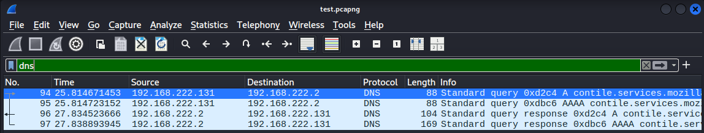

# 📱CyberSecurity-Internship - Task 5: Capture and Analyze Network Traffic Using Wireshark

## 🌟 Objective

Capture live network traffic using Wireshark and analyze common protocols such as TCP, DNS, HTTP, and TLS to understand packet structure and behavior.

---

## 🛠 Tools Used

* **Wireshark**
* **Operating System**: Kali Linux
* **Browser + Terminal**: For generating network traffic (e.g., browsing, `ping` commands)

---

## 📊 Task Steps

### Step 1: Install Wireshark

Installed Wireshark using:

```bash
sudo apt update
sudo apt install wireshark
```

### Step 2: Start Packet Capture

* Opened Wireshark
* Selected active network interface (`wlan0` or `eth0`)
* Clicked the **Start Capture** (Shark icon)

### Step 3: Generate Network Traffic

* Opened browser and visited example websites
* Ran the following:

  ```bash
  ping google.com
  ```

### Step 4: Stop and Save Capture

* Stopped the capture after \~1 minute
* Saved the output as `test.pcap` or `test.pcapng`

### Step 5: Analyze Protocols

* Applied filters like `tcp`, `http`, `dns`, and `tls`
* Identified and inspected different types of packets

---

## 📸 Screenshots

### DNS Packet



### HTTP Packet


### TCP Packet


### TLS Packet


---

## 📄 Summary

In this task, we:

* Captured real-time network packets using Wireshark
* Generated traffic using browser and terminal commands
* Identified and analyzed common network protocols
* Exported capture and documented findings visually

✅ This task provided hands-on experience in basic **network protocol analysis** and **packet inspection**.
